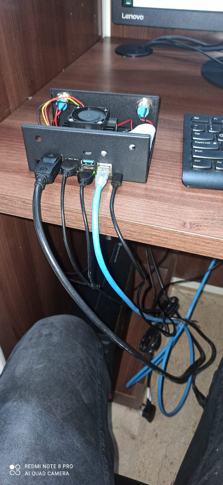
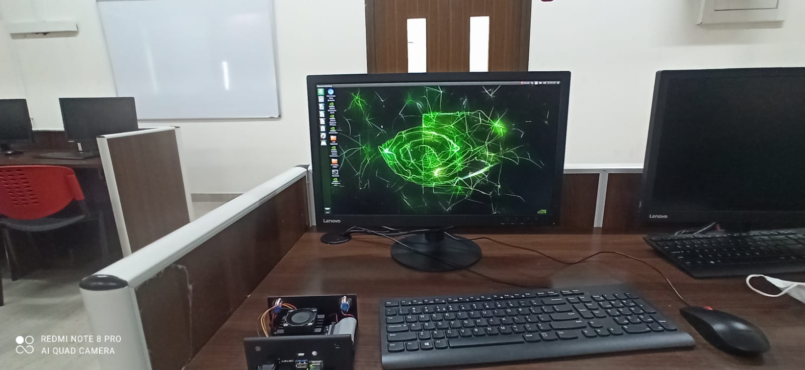

# Social-Distance-Alert-System-Using-Deep-Learning-and-Nvidia-Jetson-Nano
Developed a real-time system which will alert people whenever the social distance protocol is violated, using DeepLearning and Nvidia Jetson Nano. 
The Methodoly Proposed here can be applied on both CCTV Live Stream and Integrated Webcam.
Used YOLO V4 for person detection and approach is Compatable with all  version of Yolo Objects detection models.

<li>Components required
  <ul>1.Nvidia Jetson Nano</ul>
 <ul>2.Monitor</ul>
 <ul>3.Mouse</ul>
 <ul>4.Key Board</ul>
 <ul>5.Web camera</ul>
 <ul>6.Speaker</ul>
 <ul>7.Ethernet-dedicated Internet Access</ul>
 <ul>8.Aux to USB Cable</ul></li>
 
